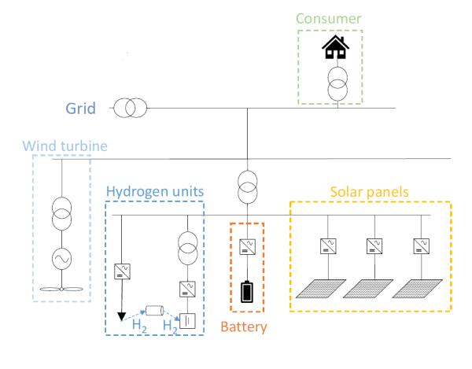

# AI Hackathon Challenge - Optimal Control of Microgrid 

## Introduction

In this challenge you will develop an operational plan that minimizes the cost for the microgrid owners.

> Microgrid is a small network of electricity users with a local source of supply 
> that is usually attached to a centralized grid but is able to function independently.

Microgrids are important for creating sustainable and cost-efficient energy systems based on renewable sources.
AI and optimization methods can be used to improve operational efficiency of microgrids. Good control algorithms ensures reliability and cost efficiency.

To develop and test your system you will use a microgrid simulator included in this repository.

The introduction presentation can be found [here](docs/AI-brAIn-hackaton-2021.pdf).

## Background

The Rye microgrid is a pilot within the EU research project REMOTE. 
It is a small microgrid placed at Langørgen, in the outskirts of Trondheim, 
and is a small energy system designed to supply electricity to a modern farm and three households. 
The REMOTE projects goal for Rye Microgrid is to run the system in islanded mode.

> A microgrid is said to be in islanded mode when it is disconnected from the main grid and 
> it operates independently with micro sources and load

The system has two sources of generation – a wind turbine and a rack of PV panels. 
In addition, the system has two storages – a battery with high charge and discharge response, but with limited storage and losses, 
and a hydrogen energy system, with lower charge and discharge rates, higher losses and storage capacity. 
When you want to charge the hydrogen system, electricity is used to run an electrolyser that makes hydrogen from water and stores the resulting hydrogen in a tank. 
The process can be reversed by producing electricity from hydrogen using a fuel cell. 
For simplicity, minimum charging levels and wear- and tear costs are disregarded in this context.
We also simplify and collect all losses in the conversion process to and from the storages as charge loss. These losses are given as the round trip efficiency in the table below. Thus there are only losses when charging the storages, not when discharging.

Morover, when local production or discharges from storages are not sufficient to cover the demand, the microgrid can draw electricity from
the grid at some costs.



## Task

The task of this assignment is to make a control system that minimizes the cost of operation of the microgrid, 
given the uncertainty of future consumption and generation from the wind turbine and PV. With clever operation of the microgrid, it should be possible to minimise the cost of grid imports. Your task is to develop a system that optimise the operation of the storages, given limited insight into future PV and wind generation and consumption.

The sole cost element is related to the import of electricity from the grid.
The cost of using electricity from the grid has 3 elements:
- An hourly, variable electricity **spot price** – given as part of the dataset as NOK/kWh 
- An energy part of the **grid tariff**, which is paid per kWh that is imported. In this assignment we use the Tensio winter energy tariff: 0.05 NOK/kWh
- A **peak tariff** that is paid monthly, based on the maximum instantaneous power (measured hourly) imported to the microgrid: 49 NOK/month/kWpeak

The system is operated under the following restrictions:

- Consumption, PV and wind generation are all stochastic variables. 
  These can only be observed, not decided. 
  Weather (temperature, wind speed, solar radiation e.t.c. is a main driver behind these stochastic processes). 
- Consumption must be met in all timesteps – either through 
  wind generation, PV generation, discharge from storages or import from the grid. 
- Given that storages are not full, they can be charged by PV generation, wind generation, or import from the grid. 
  For simplicity, we assume that the energy being stored is equal to the charging of the storage units times the round trip efficiency, 
  and that the systems can be discharged without any losses. 
- The microgrid is too large to join any current Norwegian prosumer scheme, 
  thus excess production cannot be fed back into the grid. 
  If production is larger than consumption, and all storages full, 
  then excess production is curtailed (thrown away).
- All losses from transformers and distribution lines can be neglected.

The mathematical description can be found in this [document](docs/rye_simulator.pdf).

Technical data is found in the table below:

|System|Attribute|Value|
|---|---|---|
|Microgrid|Latitude|63°24'47.0"N|
| |Longitude|10°06'46.0"E|
|Wind turbine|Brand|VESTAS V27|
| |Max power|225 kW|
| |Hub Height|31.5 m|
| |Cut-in wind speed|3.5 m/s|
| |Rated wind speed|14 m/s|
|Photo Voltaic system|Brand|REC TwinPeak2|
| |Rated output power|86.4kWp|
|Battery Energy Storage System|Brand|Nidec/ LG Chem|
| |Storage capacity|500 kWh|
| |Charge/discharge capacity|400 kWh/h|
| |Round trip efficiency|85%|
|Hydrogen system|Storage capacity|1670 kWh|
| |Electrolyser (charge) capacity|55 kW|
| |Fuel cell (discharge) capacity|100 KW|
| |Round trip efficiency|32.5%|


## Data description
Data is stored in `data/train.csv`.
It contains production and consumption measures and weather parameters for every hour of the training period.
This data you can use in the development of the controller.

Later in the event you will get `data/test.csv` for the test period used in final evaluation.
It has the same parameters but for another period. 
You should only use it in for running the evaluation script to get the final score.

Both files contain the following parameters (columns in the file):

- `pv_production` - production from solar panels in kWh/h
- `wind_production` - production from wind turbine in kWh/h
- `consumption` - consumption in kWh/h
- `spot_market_price` - energy price per NOK/kWh
- `precip_1h:mm` - amount of rainfall in millimeters that has fallen during the indicated interval.
- `precip_type:idx` - integer indicating the precipitation type (
  0 - none, 
  1 - rain, 
  2 - rain and snow mix,
  3 - snow,
  4 - sleet,
  5 - freezing rain,
  6 - hail)
- `prob_precip_1h:p` - precipitation probability
- `clear_sky_rad:W` - instantaneous flux of clear sky radiation in Watts per square meter.
- `clear_sky_energy_1h:J` - accumulated clear sky flux over the given interval in Joules per square meter.
- `(diffuse|direct|global)_rad:W` - instantaneous flux of diffuse, direct or global radiation in Watts per square meter.
- `(diffuse|direct|global)_rad_1h:Wh` - accumulated energy of diffuse, direct or global radiation in Wh per square meter.
- `sunshine_duration_1h:min` - amount of time the sun was shining within the requested interval.
- `sun_azimuth:d` - solar azimuth angle defines the sun's relative direction along the local horizon.
- `sun_elevation:d` - solar elevation angle (angle between the sun and the horizon) gives the position of the sun above the horizon.
- `(low|medium|high|total|effective)_cloud_cover:p` - amount of cloud cover in percent at different levels in percent.
- `t_(2|10|50|100):C` - temperature in Celsius at 2, 10, 50 or 100 meters above ground.
- `relative_humidity_(2|10|50|100)m:p` - instantaneous value of the relative humidity in % at 2, 10, 50 or 100 meters above ground.
- `dew_point_(2|10|50|100)m:C` - instantaneous value of the dew point temperature in Celsius at 2, 10, 50 or 100 meters above ground.
- `wind_speed_(2|10|50|100)m:ms` - wind speed in meters per second at 2, 10, 50 or 100 meters above ground.
- `wind_dir_(2|10|50|100)m:d` - wind direction in degrees at 2, 10, 50 or 100 meters above ground.

All timestamps in the data are stored in UTC (Coordinated Universal Time).

## Guidelines for using the data

- Consumption, PV production and wind production are only known the hour after it takes place. Future values of consumption and production **can't be used** in the control strategy.
- Weather data are seen as weather forecast, thus you can include future values in your control strategy
- Spot prices becomes available in vectors of 24 hours once a day. The forecasts for next day is available at 13:00. Thus, future prices can be included 12-25 hours ahead in time, depending on the hour of the day.

For **development purposes only** you might want to assume that consumption and production observations are forecasts. This way part of the team can work on control policy and part on the forecasts. At the end replace observations with forecasts

## Development environment setup

This setup should work in Windows, Max and Linux.

1. Install miniconda for Python 3.8 64-bit from the [official page](https://docs.conda.io/en/latest/miniconda.html).
2. Setup conda environment defined in `environment.yaml`:
```sh
conda env create -f environment.yaml
```
3. Activate environment in the terminal:
```sh
conda activate rye-flex-env
```
4. Select `rye-flex-env` as your interpreter in your IDE:
- [VS Code](https://code.visualstudio.com/docs/python/environments)
- [PyCharm](https://www.jetbrains.com/help/pycharm/conda-support-creating-conda-virtual-environment.html)

5. To install addition packages use `pip install` or `conda install` commands in 
the terminal when the environment is activated. 
The environment includes Python packages necessary to run the simulator and load the data.
Here are some packages you might find useful:
- [scikit-learn](https://scikit-learn.org/stable) - machine learning 
- [pyomo](http://www.pyomo.org) - optimization modeling language
- [pytorch](https://pytorch.org) - machine and deep learning library
- [stable-baselines3](https://github.com/DLR-RM/stable-baselines3) - reinforcement learning
- [deap](https://github.com/DEAP/deap) - evolutionary algorithms

## Simulator

This repository includes a microgrid simulator that you will be using for developing and testing your system.
The simulator is implemented as [OpenAI Gym](https://gym.openai.com/).
It is recommended to read the [official docs](https://gym.openai.com/docs/#observations) from OpenAI to get familiar with the basic concepts.
Even though gyms were introduced for training deep reinforcement learning agents, they provide a generic interface for any control system.

You can see example of a random agent using the microgrid environment gym in `scripts/random_action.py`.
Your task is to do better (ideally much better) than taking random actions.
Action and state (observation) variables are documented in `src/rye_flex_env/states.py`.
The environment itself is implemented in `src/rye_flex_env/env.py`.
It can be an advantage to understand what is going on in the code.

## Evaluation

Evaluation will be done with the evaluation script `scripts/evaluation.py`.
It uses `data/test.csv` data file that will be shared (pushed to the repo) with the participants on **Saturday at 18:00**.
The participants are expected to add the code for using their system agent in this script 
and then run it once to get the score. 
Don't modify the reward function or do it in a way to preserve the original cumulative reward.
The score should be included in your presentation.
Also the code to reproduce both training and testing of your system should be pushed to your team GitHub repo
and shared with the judges.

Evaluation criteria:
- Score = cumulative reward for test period​
  - Reproducibility - we can run your code to get the same/similar score​
- Methodology​
  - Method selection​
  - System design​
  - System implementation​
- Presentation​
  - Show your score​
  - Plots with actions and environment state​
  - Explanation and justification of choices made

Happy hacking!
